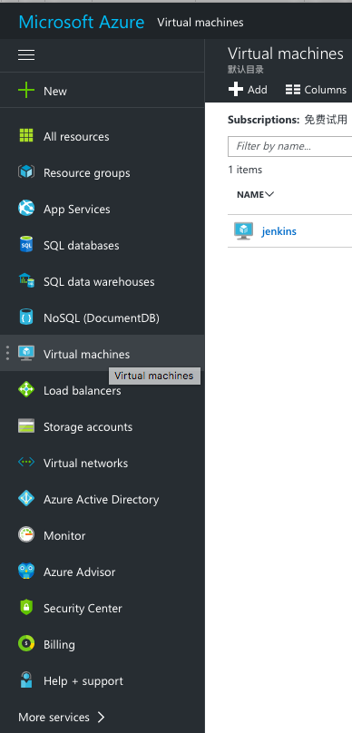
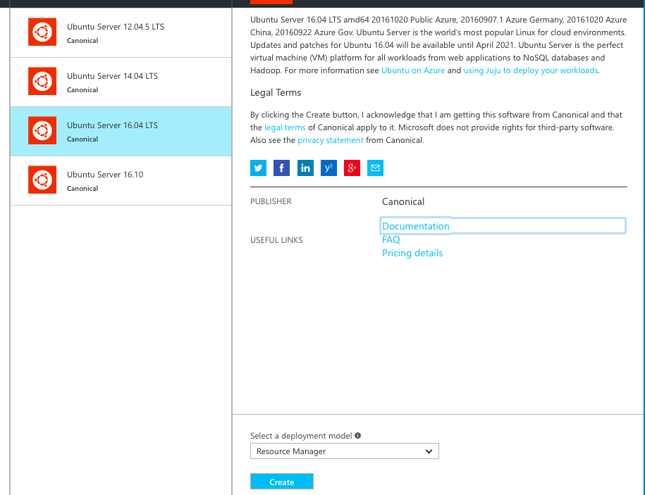
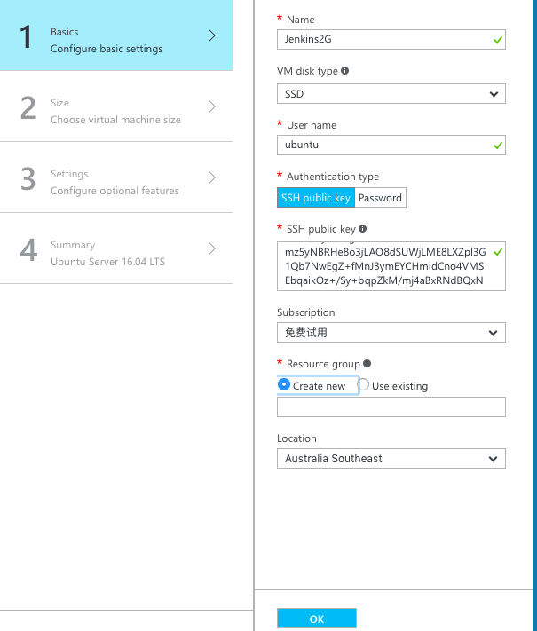
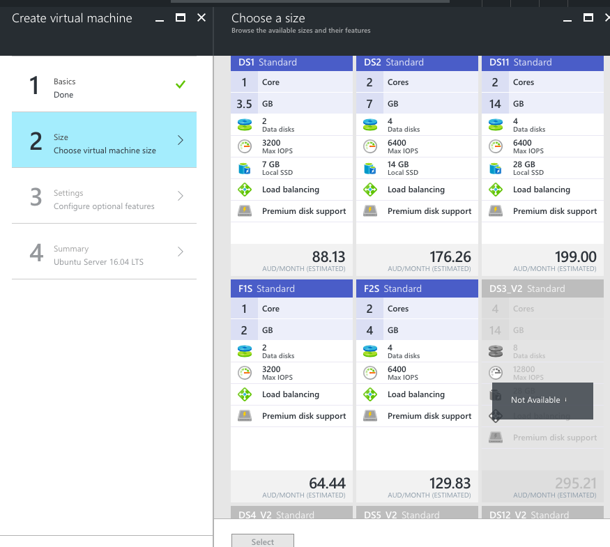
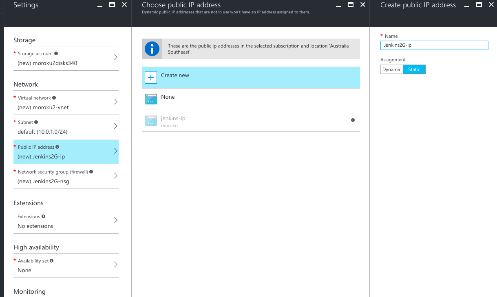
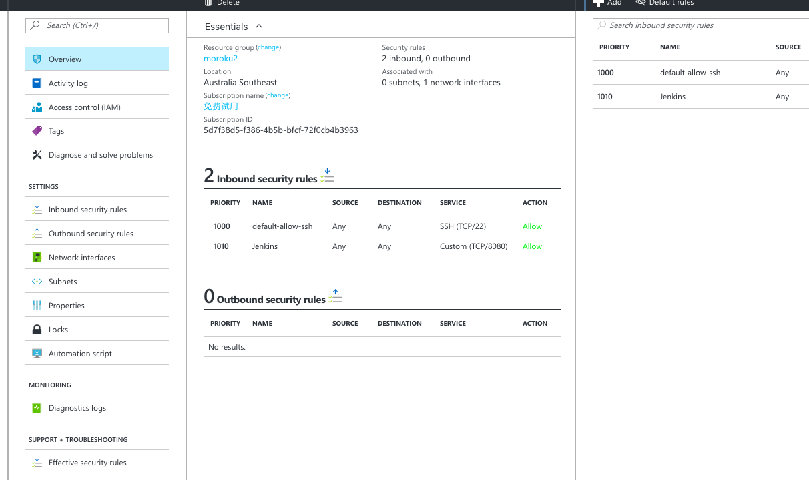

## Creat the VM on Azure
* Login with your ID on Microsoft Azure. Select Virtual Machines a.k.a VM

* Add a new VM -> Choose **Ubuntu Server 16.04 LTS** 
* Ensure the deployment model is **Resource Manager**

* Input basic properties of the VM

* Choose the VM Memory and CPU

> 2G memory at least, if using Android Emulator for Android Unit Test, 3.5G+ memory should be selected.

* Change the IP to static IP and write down the server IP.

* Make the 8080 port accessable in **Network interface**

-------
